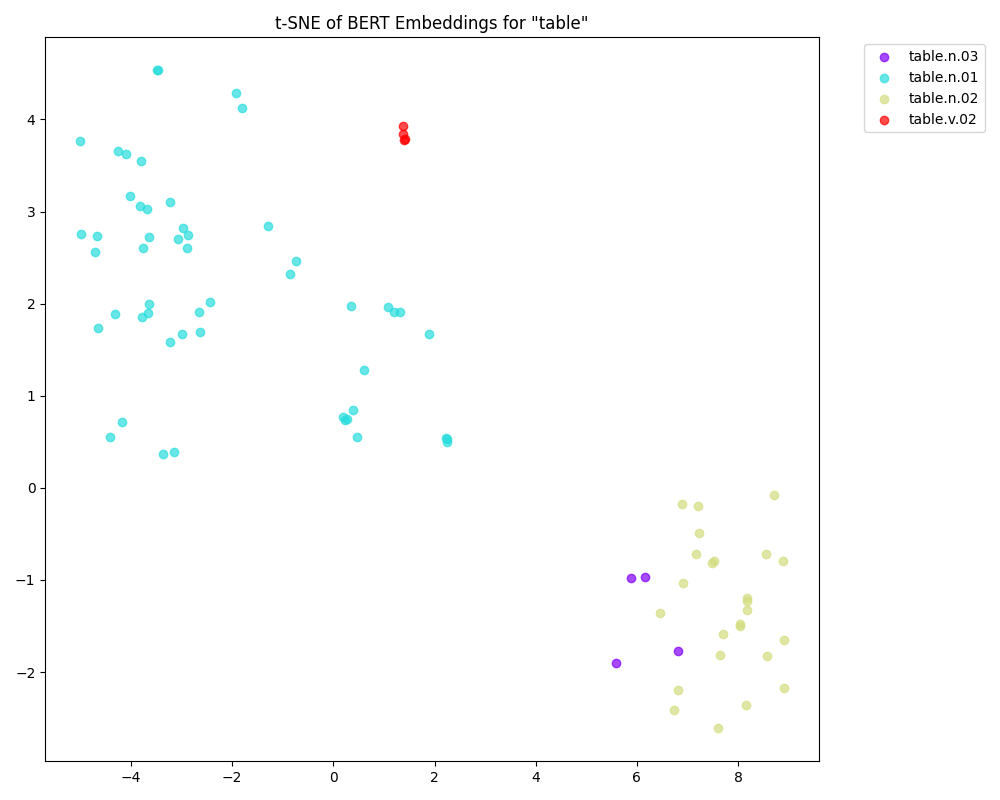
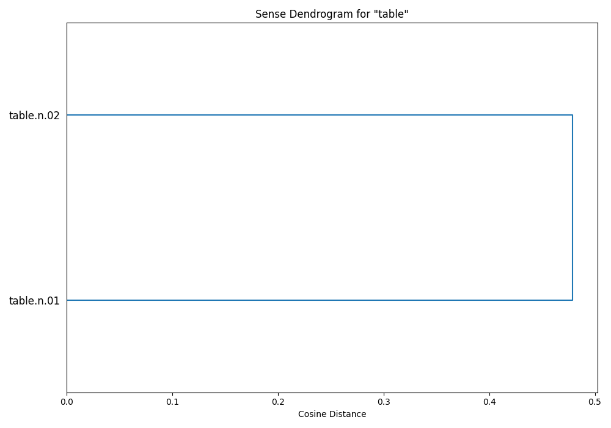
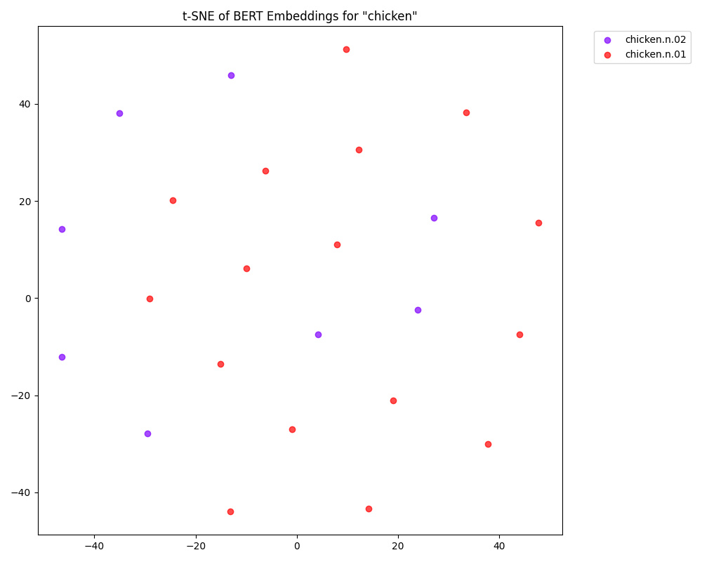
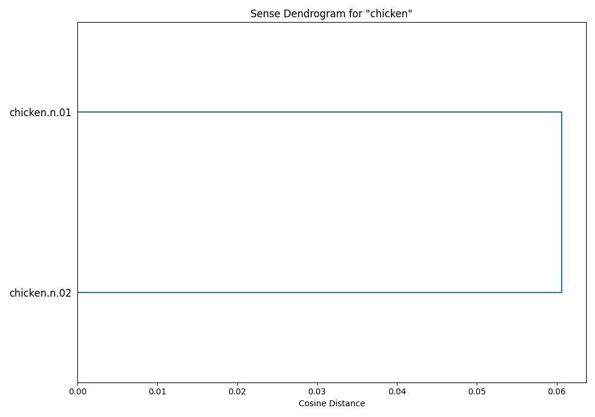
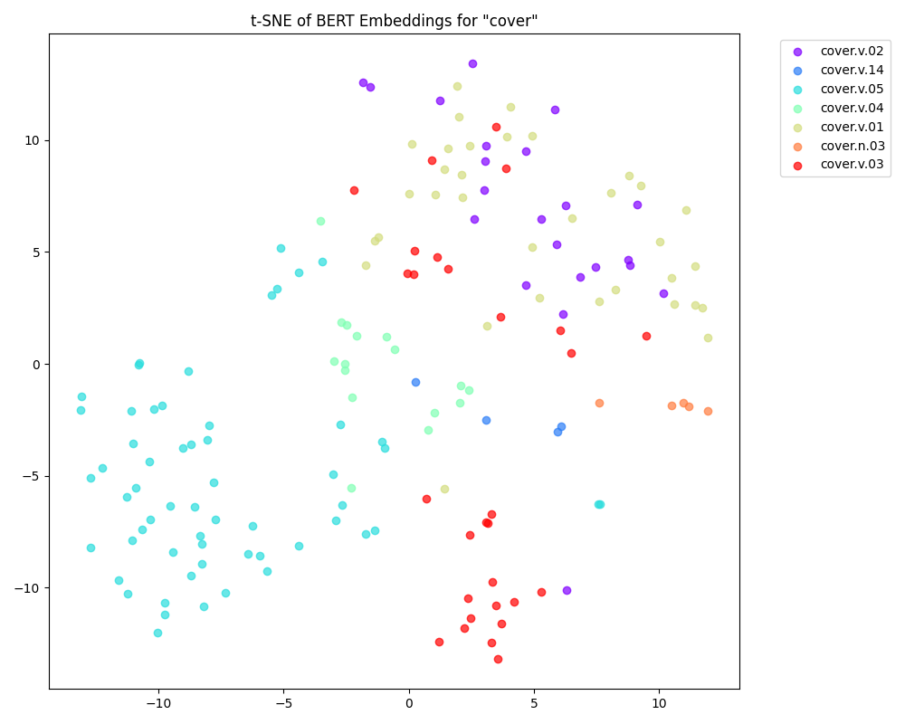
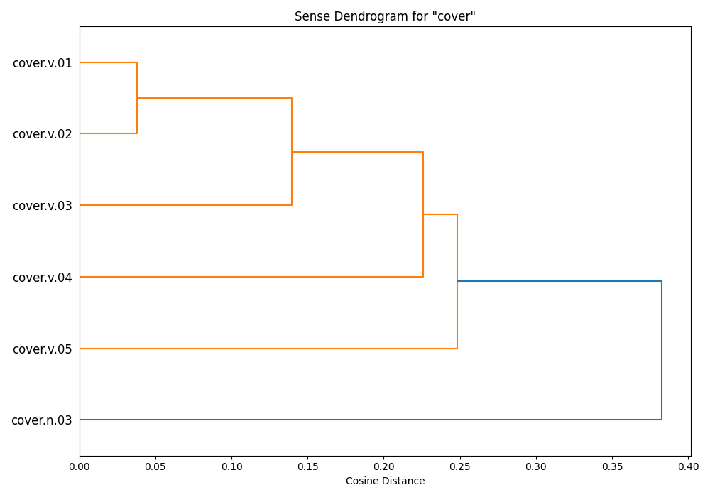

# BERT Sense Knowledge Reproduction

> **Do Contextualized Word Embeddings Encode Aspects of Human-Like Word Sense Knowledge?**
> A reproduction of the research methodology exploring how BERT embeddings capture homonymy and polysemy.


---

##  Abstract

This project reproduces the core computational experiments from the paper *Contextualized Word Embeddings Encode Aspects of Human-Like Word Sense Knowledge* (Nair et al., 2020). 

The goal is to investigate whether **BERT (Bidirectional Encoder Representations from Transformers)** embeddings capture human-like distinctions in word senses, specifically distinguishing between **homonymy** (unrelated meanings, e.g., *bat* as animal vs. sports equipment) and **polysemy** (related meanings, e.g., *chicken* as animal vs. meat).

By extracting contextualized embeddings from the **SemCor** corpus and analyzing their geometry, this project demonstrates that BERT's embedding space reflects these semantic relationships, with homonymous senses being significantly more distant than polysemous ones.

> **Note**: This reproduction focuses on the *computational modeling* components of the paper (Section 3.4 onwards). The human behavioral experiments (Section 3.2) are not included as they rely on proprietary participant data.

##  Key Features

*   **Dynamic Data Loading**: Automated scanning of the NLTK **SemCor** corpus to find and align specific lemma occurrences.
*   **Advanced Embedding Extraction**: Implementation of the paper's specific embedding strategy:
    *   Summation of the **last four hidden layers** of `bert-base-uncased`.
    *   Subword alignment and averaging to obtain precise word-level vectors.
*   **Geometric Analysis**:
    *   Computation of **Sense Centroids**.
    *   **Cosine Distance** analysis to quantify semantic relatedness.
    *   **Hierarchical Clustering (Dendrograms)** to visualize sense relationships.
    *   **t-SNE Projections** for 2D visualization of the embedding space.
*   **Metric Calculation**:
    *   **Sense Entropy**: Calculation of Shannon entropy to characterize sense distributions.
    *   **Pairwise Confusion Relatedness**: Implementation of the confusion-probability metric proposed in Section 4.3.
*   **Sense Classification**: 
    *   5-fold cross-validation using **Logistic Regression with L1 penalty**.
    *   Comparison against **Majority Class** and **Random** baselines.

---

##  Methodology

1.  **Data Source**: We use **SemCor**, a subset of the Brown Corpus annotated with WordNet sense tags.
2.  **Embedding Generation**: 
    *   Sentences containing target words are passed through `bert-base-uncased`.
    *   Embeddings are derived by summing the last 4 layers.
    *   Subword tokens corresponding to the target word are averaged to produce a single vector.
3.  **Analysis**:
    *   **Centroids**: The mean vector for all instances of a specific sense `s` is computed: $C_s = \frac{1}{|s|} \sum_{v \in s} v$.
    *   **Distance**: We calculate $1 - \cos(C_{s1}, C_{s2})$.
    *   **Classification**: A Logistic Regression classifier (L1 penalty) predicts word senses. We compare its weighted F1 score against random and majority baselines.
    *   **Confusion Relatedness**: We derive semantic relatedness from the classifier's confusion matrix: $R(s1, s2) = \frac{P(s2|s1) + P(s1|s2)}{2}$.

---

##  Results & Visualization

The pipeline processes target words to reveal their semantic structure. Below are examples of the generated visualizations.

### 1. Homonymy: *Table*
*Table* has distinct, unrelated meanings (e.g., furniture vs. data arrangement).
*   **Distance**: High (~0.48).
*   **Classification**: Perfect separation (F1 Score: 1.0).

| t-SNE Projection | Hierarchical Clustering |
|:---:|:---:|
|  |  |

### 2. Polysemy: *Chicken*
*Chicken* has closely related meanings (animal vs. meat).
*   **Distance**: Low (~0.06).
*   **Confusion**: High pairwise confusion between senses.

| t-SNE Projection | Hierarchical Clustering |
|:---:|:---:|
|  |  |

### 3. Complex Polysemy: *Cover*
*Cover* exhibits a spectrum of related senses.

| t-SNE Projection | Hierarchical Clustering |
|:---:|:---:|
|  |  |

---

##  Installation

1.  **Clone the repository:**
    ```bash
    git clone https://github.com/yourusername/bert-sense-knowledge.git
    cd bert-sense-knowledge
    ```

2.  **Install dependencies:**
    It is recommended to use a virtual environment.
    ```bash
    pip install -r requirements.txt
    ```

3.  **Download NLTK Data:**
    The project includes a setup script to automatically fetch SemCor and WordNet data.
    ```bash
    python setup.py
    ```

##  Usage

Run the main analysis pipeline to reproduce the results and generate plots:

```bash
python main.py
```

This script will:
1.  Load SemCor data for defined target words (`table`, `bat`, `chicken`, `cover`, `bank`).
2.  Extract BERT embeddings (using GPU if available).
3.  Compute metrics (Entropy, Distances, Classification Scores).
4.  Generate and save `.png` visualizations in the project root.

##  Project Structure

```
bert_sense_knowledge/
├── src/
│   ├── __init__.py
│   ├── analysis.py      # Classification (L1), Entropy, Distances, Confusion Matrix, Plotting
│   ├── data_loader.py   # SemCor corpus parsing and alignment
│   └── model.py         # BERT model wrapper and embedding extraction
├── main.py              # Orchestration script
├── requirements.txt     # Python dependencies
├── setup.py             # NLTK data downloader
└── README.md            # Project documentation
```

##  References

*   **Original Paper**: Nair, S., Srinivasan, M., & Meylan, S. (2020). *Contextualized Word Embeddings Encode Aspects of Human-Like Word Sense Knowledge*. arXiv:2010.13057.
*   **BERT**: Devlin, J., Chang, M. W., Lee, K., & Toutanova, K. (2018). *BERT: Pre-training of Deep Bidirectional Transformers for Language Understanding*.

---
*Implemented as a reproduction study.*
